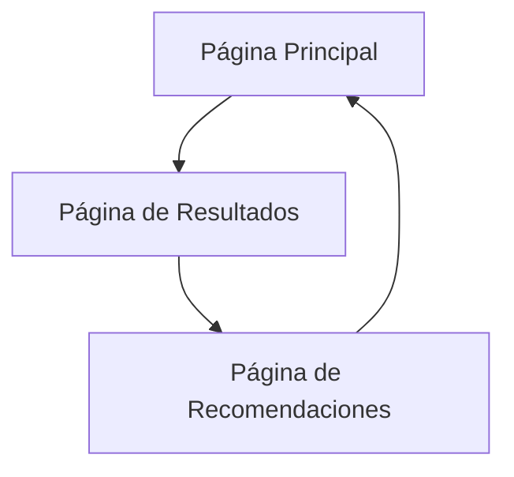

# Calculadora de Rentabilidad para Restaurantes

## 1. Descripción General del Producto

Calculadora web intuitiva que permite a propietarios de restaurantes obtener un diagnóstico completo de rentabilidad en menos de 5 minutos. La herramienta analiza datos financieros clave y proporciona métricas automáticas, diagnósticos visuales y recomendaciones personalizadas para mejorar la rentabilidad del negocio.

El producto resuelve la necesidad crítica de los restauranteros de entender rápidamente su situación financiera y identificar áreas de mejora específicas. Dirigido a propietarios y gerentes de restaurantes que buscan optimizar sus operaciones financieras.

Objetivo: Convertirse en la herramienta de referencia para análisis financiero rápido en el sector gastronómico.

## 2. Características Principales

### 2.1 Roles de Usuario

| Rol | Método de Registro | Permisos Principales |
|-----|-------------------|---------------------|
| Usuario Propietario | Acceso directo sin registro | Puede ingresar datos financieros, ver análisis completo y descargar reportes |

### 2.2 Módulo de Características

Nuestra calculadora de rentabilidad consta de las siguientes páginas principales:

1. **Página Principal**: formulario de entrada de datos paso a paso, navegación intuitiva.
2. **Página de Resultados**: dashboard de métricas calculadas, diagnósticos visuales con códigos de color.
3. **Página de Recomendaciones**: análisis personalizado, acciones concretas sugeridas.

### 2.3 Detalles de Páginas

| Nombre de Página | Nombre del Módulo | Descripción de Características |
|------------------|-------------------|--------------------------------|
| Página Principal | Formulario de Datos | Capturar ingresos mensuales, CMV, costos de personal, costos fijos y variables mediante formulario paso a paso con validaciones |
| Página Principal | Navegación Guiada | Mostrar progreso del formulario, botones de navegación, tooltips explicativos para cada campo |
| Página de Resultados | Cálculos Automáticos | Calcular beneficio bruto (Ingresos - CMV), beneficio neto, margen de beneficio neto (%), punto de equilibrio |
| Página de Resultados | Diagnóstico Visual | Mostrar métricas con códigos de color (rojo/amarillo/verde) basados en estándares del sector, gráficos de barras y circulares |
| Página de Resultados | Comparación Sectorial | Comparar CMV ideal (<30%), costos de personal (<35%), margen neto saludable (>10%) |
| Página de Recomendaciones | Análisis Personalizado | Generar 3 recomendaciones específicas basadas en los resultados obtenidos |
| Página de Recomendaciones | Acciones Concretas | Sugerir escandallo de platos, optimización de horarios, negociación con proveedores según las métricas |

## 3. Proceso Principal

El usuario accede a la calculadora y completa un formulario guiado en 4 pasos: 1) Ingresos mensuales, 2) Costo de mercancía vendida, 3) Costos de personal, 4) Costos operativos (fijos y variables). Al finalizar, el sistema calcula automáticamente las métricas clave y presenta un dashboard visual con diagnóstico por colores. Finalmente, genera recomendaciones personalizadas basadas en los resultados obtenidos.

## 4. Diseño de Interfaz de Usuario

### 4.1 Estilo de Diseño

- **Colores primarios y secundarios**: Paleta de Chefbusiness.co - azul corporativo (#1E3A8A), verde éxito (#10B981), naranja acento (#F59E0B)
- **Estilo de botones**: Botones redondeados con sombras suaves, efectos hover, estilo moderno
- **Fuente y tamaños preferidos**: Inter o similar, títulos 24px, texto 16px, labels 14px
- **Estilo de layout**: Diseño de tarjetas con espaciado generoso, navegación superior fija
- **Sugerencias de emojis/iconos**: Iconos de Font Awesome, emojis para métricas (📊 📈 💰), estilo minimalista

### 4.2 Resumen de Diseño de Páginas

| Nombre de Página | Nombre del Módulo | Elementos de UI |
|------------------|-------------------|----------------|
| Página Principal | Formulario de Datos | Tarjetas paso a paso, campos de entrada con validación, barra de progreso, botones CTA prominentes |
| Página Principal | Navegación Guiada | Stepper horizontal, tooltips informativos, iconos descriptivos, animaciones suaves |
| Página de Resultados | Cálculos Automáticos | Tarjetas de métricas con números grandes, iconos representativos, animaciones de conteo |
| Página de Resultados | Diagnóstico Visual | Gráficos Chart.js, códigos de color semáforo, badges de estado, comparaciones visuales |
| Página de Recomendaciones | Análisis Personalizado | Lista de recomendaciones con iconos, tarjetas expandibles, botones de acción |

### 4.3 Responsividad

La aplicación es mobile-first con adaptación completa a desktop. Incluye optimización para interacciones táctiles, menús colapsables en móvil y reorganización de contenido según el tamaño de pantalla.